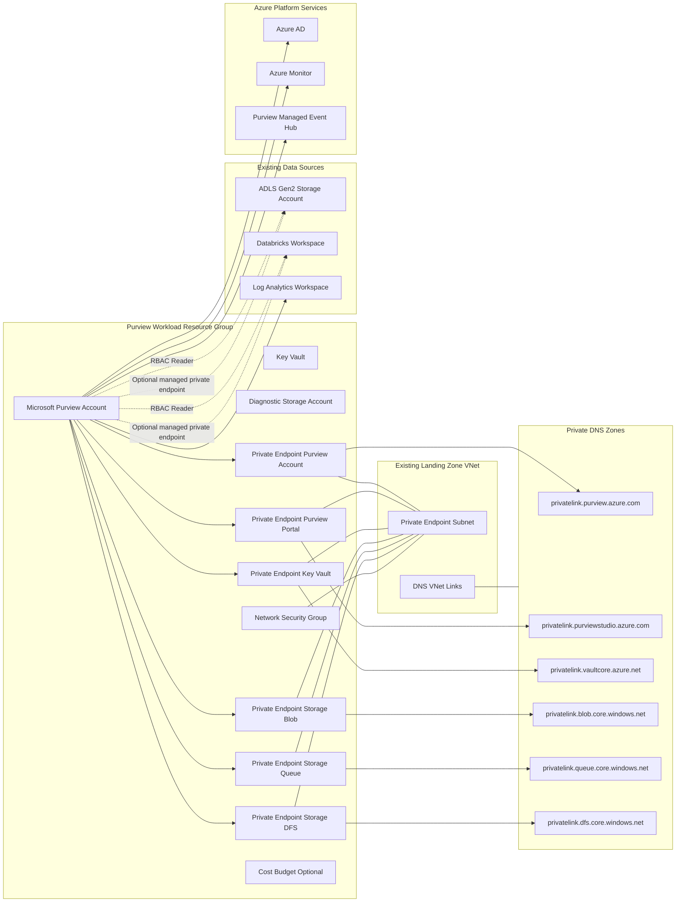

# Purview Architecture Diagram

## Overview

This diagram represents the deployed architecture for the Purview implementation in this repository.

The architecture is organized across five logical planes:

- **Purview Workload Resource Group** — the core deployment boundary containing all provisioned resources.
- **Existing Landing Zone VNet** — the customer-managed virtual network that hosts the private endpoint subnet and DNS VNet links.
- **Private DNS Zones** — either created by this stack or reused from a hub subscription, enabling private name resolution for all services.
- **Existing Data Sources** — ADLS Gen2, Databricks, and Log Analytics that Purview scans and sends telemetry to.
- **Azure Platform Services** — Azure AD for identity, Azure Monitor for metrics, and the Purview-managed Event Hub for catalog events.

All inbound and outbound traffic is routed exclusively over private endpoints. Public network access is disabled on every resource. The Network Security Group enforces an explicit allow-list of outbound service tags and a default-deny posture for all other traffic.

## Component Descriptions

### Purview Workload Resource Group

| Component | Purpose |
|---|---|
| Microsoft Purview Account | Core data governance service with system-assigned managed identity. Hosts the data catalog, data map, and scanning engine. |
| Key Vault | Stores secrets and credentials used by Purview scanning. RBAC-authorized, public access disabled, purge-protection enabled. |
| Diagnostic Storage Account | Receives diagnostic logs and metrics exported from Purview. StorageV2 with GRS, shared key access disabled, public access off. |
| Network Security Group | Attached to the private endpoint subnet. Enforces an explicit outbound allow-list for required service tags and default-deny for all other traffic. |
| Private Endpoints | Six private endpoints eliminate all public internet exposure for Purview (account + portal), Key Vault, and Storage (blob, queue, DFS). |
| Cost Budget (Optional) | Monthly budget on the resource group with 80%, 90%, and 100% alert thresholds. Enabled via feature flag. |

### Existing Landing Zone VNet

The landing zone virtual network is pre-existing and managed outside this stack. This deployment attaches to it by placing all private endpoints in the designated private endpoint subnet and registering DNS VNet links so private zone records resolve within the VNet.

### Private DNS Zones

Six private DNS zones are required — one per private endpoint service. This stack either creates them (`create_private_dns_zones = true`) or reads them from an existing hub subscription via the `azurerm.hub` provider alias (`create_private_dns_zones = false`). DNS A-records are registered automatically when each private endpoint is created.

| Zone | Service |
|---|---|
| privatelink.purview.azure.com | Purview Account API |
| privatelink.purviewstudio.azure.com | Purview Studio Portal |
| privatelink.vaultcore.azure.net | Key Vault |
| privatelink.blob.core.windows.net | Storage Blob |
| privatelink.queue.core.windows.net | Storage Queue |
| privatelink.dfs.core.windows.net | Storage DFS (ADLS) |

### Existing Data Sources

Purview's managed identity is granted `Storage Blob Data Reader` on the ADLS Gen2 account and `Reader` on the Databricks workspace. These RBAC assignments allow Purview to scan and catalog assets without storing credentials. Connectivity to these sources can optionally be hardened further using Purview managed private endpoints, controlled by feature flags.

### Azure Platform Services

Purview communicates with Azure AD for managed identity authentication, Azure Monitor for publishing metrics, and its own managed Event Hub for catalog and scan event streaming. These connections are outbound from Purview and permitted through the NSG outbound allow-list.

## Notes

- Private DNS zones are either created in this stack or read from an existing hub subscription.
- Purview account naming is explicit; Key Vault, Storage, NSG, and Resource Group names are generated by the naming module.
- Managed private endpoints to ADLS and Databricks are optional and controlled by the `create_managed_private_endpoints`, `enable_adls_managed_endpoint`, and `enable_databricks_managed_endpoint` feature flags.
- The deployment identity requires read access in the hub subscription and resource group when reusing existing DNS zones.
